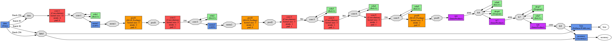

# 一、caffe介绍与安装

## 1. 什么是caffe

​		全称：Convolution Architecture For Feature Embedding

​		开源DL开发框架

​		特点：

- C++/CUDA深度学习库
- 丰富的参考模型和demo
- 支持命令行。python接口，matlab接口
- 支持GPU/CPU
- 对已有模型修改无需编码
- 图像领域，扩展

## 2. Why caffe？

​		github统计数据：

​				Tensorflow：主要使用

​				Caffe：主要使用

​				Keras: 调试不方便

​				MXNET：国人开发，关注少

​				Torch

## 3. Caffe能做什么？

​		图片分类：http://demo.caffe.berkelyvision.org/

​		场景预测（图片分类）: http://places.csail.mit.edu/

​		物体识别：https://github/rbgirshick/py-faster-rcnn

​		图像语义分割：https://github.com/shelhamer/fcn.berkeleyvision.org

## 4. How–安装Caffe

​		建议：Ubuntu系统

​		CUDA、

​		CuDnn、

​		python2.7、

​		opencv2、

​		GitHub.com/BVLC/caffe

​		官网更新包命令、

​		编译前修改配置文件、

​		环境变量、

​		测试import caffe

​		

​		Windows系统：

​		Visual studio、

​		CUDA、

​		cuDNN、

​		Conda python

​		github.com/Microsoft/caffe		

​		github.com/BVLC/caffe/treee/windows

​		更新conda源，下载各种包，

​		编译前修改配置文件、

​		VS打开后先用nuget还原

​		编译caffe，pycaffe	

​		测试import caffe


# 二、caffe初体验

## 1. 流程：

​		准备数据 -》定义Net-》配置Solver-》Run-》分析结果

​		数据					模型				算法

## 2. 模型定义

​		prototxt文件-》文件存储格式

## 3. 可视化模型

​		/python/draw_net.py

## 4. caffe文件配置

## 5. 运行caffe

​		caffe后可接4个命令

​		评估运行时间 caffe time -model mnist.prototxt -iterations 10

​		训练 caffe train -solver mnist_solver.prototxt

​		Log文件输出：2>&1 | tee a.log	错误输出重定向到标准输出，通过管道输出到a文件

## 6. 分析结果

​		/tools/extra/plot_training_log.py

# 三、Caffe的Layer、Net、Solver概念

## 1. 学习过程

- Data
- Net Layer
- Solver
- Pycaffe
- Tools

## 2. Layer

- Layersetup
- forward_cpu
- backward_cpu
- forward_gpu
- backward_gpu

```python
class CustomLayer(caffe.Layer):
	def setup(self, bottom, top):
		params = eval(self.param_str)
		pass
	
	def forward(self, bottom, top):
		pass
	
	def backward(self, top, propagate_down, bottom):
		pass
```

## 3. Net & Solver

```
solver = caffe.SGDSolver("")
Solver = caffe.get_solver("")

solver.step(num)
solver.solve()

solver.net
Solver.test_nets[0]

Solver.net.forward()
```

blobs->CAFFE自定义的数据结构

```
solver.net.blobs 数据
solver.net.blobs['data']
solver.net.blobs['ip1']

solver.net.blobs['ip1'].data
solver.net.blobs['ip1'].dff

solver.net.params 权值和偏置

solver.net.params['ip1']['0'].[1]
solver.net.params['ip1']['0'].data
solver.net.params['ip1']['0'].diff
```

## 4. DummyData

作用：验证网络、测试程序(无意义的数据)

```
Layer{
	name:'data'
	type:'DummyData'
	top:'data'
	dummy_data_param{
		shape:{dim:10 dim:1 dim:28 dim:28}
		data_filler:{type:'gaussian'}
	}
}
```

配置文件

```
# The train/test net 文件路径
net: "dm_py.prototxt"


# The base learning rate, momentum and the weight decay of the network.
base_lr: 0.01
momentum: 0.9
weight_decay: 0.0005

# The learning rate policy
lr_policy: "inv"
gamma: 0.0001
power: 0.75

# 多少次迭代输出一次信息
display: 100
# The maximum number of iterations
max_iter: 1001
```

训练

```python
import caffe
from caffe import layers as L

def net():
    n = caffe.NetSpec()
    n.data=L.DummyData(dummy_data_param=dict(num=10, channels=1, height=28, width=28, data_filler=dict(type='gaussian')))
    n.label=L.DummyData(dummy_data_param=dict(num=10, channels=1, height=1, width=1, data_filler=dict(type='gaussian')))
    n.ip1 = L.InnerProduct(n.data, num_output=50, weight_filler=dict(type='xavier'))
    n.relu1 = L.ReLU(n.ip1, in_place=True)
    n.ip2 = L.InnerProduct(n.relu1, num_output=4, weight_filler=dict(type='xavier'))
    n.loss = L.SoftmaxWithLoss(n.ip2, n.label)

    return n.to_proto()


with open('dm_py.prototxt', 'w') as f:
    f.write(str(net()))


#载入solver文件
solver = caffe.SGDSolver('dm_solver.prototxt')

#solver.net.forward()
#solver.step(1)
#solver.solve()

print solver.net.blobs['data'].data.shape
print solver.net.blobs['label'].data.shape
```


## 5. ImageData

作用：不想转换图片格式（效率低，经常使用，数据量大比较少用）

```
Layer{
	name:'data'
	type:'ImageData'
	top:'data'
	top:'label'
	image_data_param{
		source:"xxx"
		batch_size:200
		new_height:28
		new_width:28
	}
}
```

生成数据文件

```python
import os
import cv2
import numpy as np
import pdb

def write_img_list(data, filename):
    with open(filename, 'w') as f:
        for i in xrange(len(data)):
            f.write(data[i][0]+' '+str(data[i][1])+'\n')


image_size = 28
s='ABCDEFGHIJ'

filedir='/home/hbk/caffe/data/notMNIST/notMNIST_small/'


# 1. read file
filedir2 = os.listdir(filedir)

datasets=[]
data=[]
for subdir in filedir2:
    if os.path.isdir(filedir+subdir):
        files=os.listdir(filedir+subdir)
        dataset = np.ndarray(shape=(len(files), image_size, image_size),
                         dtype=np.float32)
        
        num_image = 0
        for file in files:
            if file[-3:]=='png':
                tmp=cv2.imread(filedir+subdir+'/'+file,cv2.IMREAD_GRAYSCALE)
                #判断图像大小是否符合要求，不符合则跳过
                try:
                    if tmp.shape==(image_size,image_size):
                        datasets.append((filedir+subdir+'/'+file, s.rfind(subdir)))
                        data.append(tmp)
                        num_image+=1
                    else:
                        print subdir,file,tmp.shape
                except:
                    print subdir,file,tmp
            else:
                print file

#随机化数据序列，计算均值
np.random.shuffle(datasets)
print np.mean(np.array(data))

TRAIN_NUM = 4*len(datasets)/5

write_img_list(datasets[0:TRAIN_NUM], 'train00.imglist')
write_img_list(datasets[TRAIN_NUM:], 'test00.imglist')
```

配置文件

```
train_net: "auto_train00.prototxt"
test_net: "auto_test00.prototxt"
test_iter: 10
test_interval: 100
base_lr: 0.01
momentum: 0.9
weight_decay: 0.005
lr_policy: "fixed"

display: 100
max_iter: 1001
```

训练

```python
import caffe

from pylab import *
from caffe import layers as L

def net(img_list, batch_size, mean_value=0):
    n = caffe.NetSpec()
    n.data, n.label=L.ImageData(source=img_list,batch_size=batch_size,new_width=28,new_height=28,ntop=2, transform_param=dict(scale=1.0/255.0))
    n.ip1 = L.InnerProduct(n.data, num_output=50, weight_filler=dict(type='xavier'))
    n.relu1 = L.ReLU(n.ip1, in_place=True)
    n.ip2 = L.InnerProduct(n.relu1, num_output=10, weight_filler=dict(type='xavier'))
    n.loss = L.SoftmaxWithLoss(n.ip2, n.label)
    return n.to_proto()

with open( 'auto_train00.prototxt', 'w') as f:
    f.write(str(net( 'train00.imglist', 200)))
with open( 'auto_test00.prototxt', 'w') as f:
    f.write(str(net( 'test00.imglist', 50)))


#solver = caffe.SGDSolver( 'auto_solver00.prototxt')
solver = caffe.get_solver( 'auto_solver00.prototxt')
#按照配置文件进行训练
#solver.solve()

iternum = 1000
loss_iter = np.zeros(iternum)
for it in range(iternum):
    solver.step(1)  # SGD by Caffe
    loss_iter[it] = solver.net.blobs['loss'].data

print loss_iter
```

画出LOSS曲线

```python
solver = caffe.SGDSolver( 'auto_solver00.prototxt')

#solver.net.forward()

niter = 1000
test_interval = 100
train_loss = zeros(niter)

# The main solver loop
for it in range(niter):
    solver.step(1)  # SGD by Caffe
    train_loss[it] = solver.net.blobs['loss'].data

# output graph
_, ax1 = subplots()

ax1.plot(arange(niter), train_loss)

ax1.set_xlabel('iteration')
ax1.set_ylabel('train loss')

_.savefig('converge00.png')
```

LOSS为NAN的情况

- LOSS太大
- LOSS发散

方法：

- 学习率太大，调小一点
- 图像归一化

打印准确率

​	train的准确率一般比test的准确率高一些

```
import caffe

from pylab import *
from caffe import layers as L

imgdata_mean = 108

def net(img_list, batch_size, mean_value=0):
    n = caffe.NetSpec()
    n.data, n.label=L.ImageData(source=img_list,batch_size=batch_size,new_width=28,new_height=28,ntop=2,transform_param=dict(scale=0.00390625, mean_value=mean_value))
    n.ip1 = L.InnerProduct(n.data, num_output=50, weight_filler=dict(type='xavier'))
    n.relu1 = L.ReLU(n.ip1, in_place=True)
    n.ip2 = L.InnerProduct(n.relu1, num_output=10, weight_filler=dict(type='xavier'))
    n.loss = L.SoftmaxWithLoss(n.ip2, n.label)
    n.accu = L.Accuracy(n.ip2, n.label)
    return n.to_proto()

with open('auto_train00.prototxt', 'w') as f:
    f.write(str(net('train00.imglist', 200, imgdata_mean)))
with open('auto_test00.prototxt', 'w') as f:
    f.write(str(net('test00.imglist', 50, imgdata_mean)))


solver = caffe.SGDSolver('auto_solver00_step.prototxt')

solver.net.forward()

niter = 301
plot_interval = 10
train_loss = zeros(niter)
test_acc = zeros(niter)
train_acc = zeros(niter)

# The main solver loop
for it in range(niter):
    solver.step(10)  # SGD by Caffe
    train_loss[it] = solver.net.blobs['loss'].data
    train_acc[it] = solver.net.blobs['accu'].data
    test_acc[it] = solver.test_nets[0].blobs['accu'].data


# output graph
_, ax1 = subplots()
ax2 = ax1.twinx()
ax1.plot(arange(niter), train_loss)
ax2.plot(arange(niter), test_acc, 'r', arange(niter), train_acc, 'm')
ax1.set_xlabel('iteration')
ax1.set_ylabel('train loss')
ax2.set_ylabel('accuracy')
_.savefig('converge01.png')
```

配置文件

```
train_net: "auto_train00.prototxt"
test_net: "auto_test00.prototxt"
test_iter: 60			//总数据数/每个batch
test_interval: 200		
base_lr: 0.1
momentum: 0.9
weight_decay: 0.005
lr_policy: "step"		//学习率策略改变，每隔1000次，学习率乘以gamma得到新的学习率
gamma : 0.1
stepsize : 1000
display: 200
max_iter: 10001
```

只在test输出准确率

```
import caffe

from pylab import *
from caffe import layers as L

imgdata_mean = 108

def net(img_list, batch_size, mean_value=0):
    n = caffe.NetSpec()
    n.data, n.label=L.ImageData(source=img_list,batch_size=batch_size,new_width=28,new_height=28,ntop=2,transform_param=dict(mean_value=mean_value))
    n.ip1 = L.InnerProduct(n.data, num_output=50, weight_filler=dict(type='xavier'))
    n.relu1 = L.ReLU(n.ip1, in_place=True)
    n.ip2 = L.InnerProduct(n.relu1, num_output=4, weight_filler=dict(type='xavier'))
    n.relu2 = L.ReLU(n.ip2, in_place=True)
    n.loss = L.SoftmaxWithLoss(n.relu2, n.label)
    n.accu = L.Accuracy(n.relu2, n.label, include={'phase':caffe.TEST})
    return n.to_proto()

with open( 'auto_train00.prototxt', 'w') as f:
    f.write(str(net( 'train00.imglist', 200, imgdata_mean)))
with open( 'auto_test00.prototxt', 'w') as f:
    f.write(str(net( 'test00.imglist', 50, imgdata_mean)))

```

准确率层

```python
import caffe

from pylab import *
from caffe import layers as L

imgdata_mean = 108

def net(img_list, batch_size, mean_value=0):
    n = caffe.NetSpec()
    n.data, n.label=L.ImageData(source=img_list,batch_size=batch_size,new_width=28,new_height=28,ntop=2,transform_param=dict(scale = 1/255.0, mean_value=mean_value))
    n.ip1 = L.InnerProduct(n.data, num_output=50, weight_filler=dict(type='xavier'))
    n.relu1 = L.ReLU(n.ip1, in_place=True)
    n.ip2 = L.InnerProduct(n.relu1, num_output=10, weight_filler=dict(type='xavier'))
    n.loss = L.SoftmaxWithLoss(n.ip2, n.label)
    return n.to_proto()

with open('auto_train00.prototxt', 'w') as f:
    f.write(str(net('train00.imglist', 200, imgdata_mean)))
with open('auto_test00.prototxt', 'w') as f:
    f.write(str(net('test00.imglist', 50, imgdata_mean)))


solver = caffe.SGDSolver('auto_solver00_step.prototxt')
niter = 3000
test_interval = 100
train_loss = zeros(niter)
test_acc = zeros(int(np.ceil(niter * 1.0 / test_interval)))
print len(test_acc)


# The main solver loop
for it in range(niter):
    solver.step(1)  # SGD by Caffe
    train_loss[it] = solver.net.blobs['loss'].data
    solver.test_nets[0].forward(start='data')

	#python 接口实现准确率层
    if it % test_interval == 0:
        print 'Iteration', it, 'testing...'
        correct = 0
        data = solver.test_nets[0].blobs['ip2'].data
        label = solver.test_nets[0].blobs['label'].data
        for test_it in range(60):
            solver.test_nets[0].forward()
            
            for i in range(len(data)):
                    if np.argmax(data[i]) == label[i]:
                        correct += 1

        test_acc[int(it / test_interval)] = correct * 1.0 / (len(data)  * 100)

# output graph
_, ax1 = subplots()
ax2 = ax1.twinx()
ax1.plot(arange(niter), train_loss)
ax2.plot(test_interval * arange(len(test_acc)), test_acc, 'r')
ax1.set_xlabel('iteration')
ax1.set_ylabel('train loss')
ax2.set_ylabel('test accuracy')
_.savefig('converge00.png')
```

## 6. MemoryData

常用：Python生成的数据直接灌进模型中（数据存储再memory里面）

```
layer {
  name: "data"
  type: "MemoryData"
  top: "data"
  top: "label"
  memory_data_param {
    batch_size: 200
    channels: 1
    height: 28
    width: 28
  }
}
```

网络模型

```
name: "hbk_mnist"

# train/test memory data数据层
layer {
  name: "mnist"
  type: "MemoryData"
  top: "data"
  top: "label"
  include {
    phase: TRAIN
  }
  memory_data_param {
    batch_size: 50
    channels: 2
    height: 1
    width: 1
  }
}
layer {
  name: "mnist"
  type: "MemoryData"
  top: "data"
  top: "label"
  include {
    phase: TEST
  }
  memory_data_param {
    batch_size: 50
    channels: 2
    height: 1
    width: 1
  }
}

# 全连接层，激活层为ReLU   784->50->10
layer {
  name: "ip1"
  type: "InnerProduct"
  bottom: "data"
  top: "ip1"
  param {
    lr_mult: 1
  }
  param {
    lr_mult: 2
  }
  inner_product_param {
    num_output: 50
    weight_filler {
      type: "xavier"
    }
    bias_filler {
      type: "constant"
    }
  }
}

layer {
  name: "relu1"
  type: "ReLU"
  bottom: "ip1"
  top: "re1"
}


layer {
  name: "ip2"
  type: "InnerProduct"
  bottom: "re1"
  top: "ip2"
  param {
    lr_mult: 1
  }
  param {
    lr_mult: 2
  }
  inner_product_param {
    num_output: 2
    weight_filler {
      type: "xavier"
    }
    bias_filler {
      type: "constant"
    }
  }
}

# 测试验证用，不必须，输出准确率
layer {
  name: "accuracy"
  type: "Accuracy"
  bottom: "ip2"
  bottom: "label"
  top: "accuracy"
  include {
    phase: TEST
  }
}

# 代价Cost层
layer {
  name: "loss"
  type: "SoftmaxWithLoss"
  bottom: "ip2"
  bottom: "label"
  top: "loss"
}
```


训练

```python
import caffe
import numpy as np
from pylab import *

solver = caffe.SGDSolver('hbk_mnist_solver.prototxt')

N = 1000
t = np.linspace(0, 2*np.pi, N)
x1 = np.array([t, 30+np.cos(t)])
x2 = np.array([t, 29+np.cos(t)])
y1 = np.zeros((N,1))
y2 = np.ones((N,1))
X = np.concatenate((x1.T, x2.T)).astype('float32')
y = np.concatenate((y1, y2)).astype('float32')


idx = np.arange(len(y))

# float32, C_CONTIGUOUS

# input graph
_, ax1 = subplots()
ax1.scatter(X[0:N,0],X[0:N,1],c='r')
ax1.scatter( X[N:,0],X[N:,1], c='b')
ax1.set_xlabel('t')
ax1.set_ylabel('x')
_.savefig('input.png')

X_train = X[idx,:].reshape(X.shape[0],2,1,1)
y_train = y[idx].reshape(y.shape[0],1,1,1)

X_train = np.require(X_train,requirements='C')

solver.net.set_input_arrays(X_train, y_train)
solver.test_nets[0].set_input_arrays(X_train, y_train)

for i in range(1001):
    solver.step(1)


""" 
# homework
x_min, x_max = np.min(X[:,0])-0.5, np.max(X[:,0])+0.5
y_min, y_max = np.min(X[:,1])-0.5, np.max(X[:,1])+0.5


xx, yy = np.meshgrid(np.arange(x_min, x_max, 0.02),
	                      np.arange(y_min, y_max, 0.02))
Z = np.zeros(xx.shape)
"""
# xx，yy当作模型的输入，通过forward过程得到模型的输出
# 输出赋值给Z。
# 最后用ax1.conourf(xx,yy,Z)
```

作业：

①明白set_input_array的限制

②找到问题所在，让模型收敛

③增加适当噪声

④利用contourf方法，画出模型的判决分界线


模型收敛-》解决：归一化！！

```python
import caffe
import numpy as np
from pylab import *

solver = caffe.SGDSolver('hbk_mnist_solver.prototxt')

N = 1000
t = np.linspace(0, 2*np.pi, N)
x1 = np.array([t, 30+np.cos(t)+0.3*np.random.rand(N)])
x2 = np.array([t, 29+np.cos(t)+0.3*np.random.rand(N)])
y1 = np.zeros((N,1))
y2 = np.ones((N,1))
X = np.concatenate((x1.T, x2.T)).astype('float32')
y = np.concatenate((y1, y2)).astype('float32')


for i in range(2):
    X[:,i] = (X[:,i]-np.min(X[:,i]))/(np.max(X[:,i])-np.min(X[:,i]))

idx = np.arange(len(y))
np.random.shuffle(idx)


# input graph
_, ax1 = subplots()

ax1.set_xlabel('t')
ax1.set_ylabel('x')

X_train = X[idx,:].reshape(X.shape[0],2,1,1)
y_train = y[idx].reshape(y.shape[0],1,1,1)

X_train = np.require(X_train,dtype='float32',requirements='C')
solver.net.set_input_arrays(X_train, y_train)
solver.test_nets[0].set_input_arrays(X_train, y_train)

for i in range(1001):
    solver.step(1)


x_min, x_max = np.min(X[:,0])-0.5, np.max(X[:,0])+0.5
y_min, y_max = np.min(X[:,1])-0.5, np.max(X[:,1])+0.5

xx, yy = np.meshgrid(np.arange(x_min, x_max, 0.02),
	                      np.arange(y_min, y_max, 0.02))

X_test = np.array([xx.ravel(), yy.ravel()]).T
X_test = np.require(X_test, dtype='float32', requirements='C').reshape(X_test.shape[0],2,1,1)
y_test = np.zeros((X_test.shape[0],1,1,1),dtype='float32')
solver.test_nets[0].set_input_arrays(X_test, y_test)

Z = np.zeros(xx.shape).ravel()
for i in range(int(X_test.shape[0]/50.0)):
    solver.test_nets[0].forward()
    data = solver.test_nets[0].blobs['ip2'].data
    label = np.argmax(data, axis=1)

    Z[i*50: (i+1)*50] = label


ax1.contourf(xx,yy,Z.reshape(xx.shape), levels=[0,0.5,1],colors=('r','g'))
ax1.scatter(X[0:N,0],X[0:N,1],c='r')
ax1.scatter( X[N:,0],X[N:,1],c='b')
ax1.set_xticks([])
ax1.set_yticks([])
_.savefig('output.png')
```


## 7. HDF5

Hierarchical Data Format: 分层的数据格式（支持大数据）

```
Layer{
	name:'data'
	type:'HDF5Data'
	top:'data'
	top:'label'
	hdf5_data_param{
		source:"xxx.h5list"
		batch_size:100
	}
}
```

创建数据

```python
import h5py
import numpy as np


N = 10000
t = np.linspace(0, 2*np.pi, N)
x1 = np.array([t, 30+np.cos(t)+0.3*np.random.rand(N)])
x2 = np.array([t, 29+np.cos(t)+0.3*np.random.rand(N)])
y1 = np.zeros((N,1))
y2 = np.ones((N,1))
X = np.concatenate((x1.T, x2.T)).astype('float32')
y = np.concatenate((y1, y2)).astype('float32')
#X = np.concatenate((x1.T, x2.T))
#y = np.concatenate((y1, y2))

for i in range(2):
    X[:,i] = (X[:,i]-np.min(X[:,i]))/(np.max(X[:,i])-np.min(X[:,i]))

idx = np.arange(len(y))
np.random.shuffle(idx)

filenum = 10
filelen = len(y)/10

for i in range(filenum):
    with h5py.File('train'+str(i)+'.h5', 'w') as f:
        f.create_dataset('data',  data=X[idx[i*filelen:(i+1)*filelen],:])
        f.create_dataset('label', data=y[idx[i*filelen:(i+1)*filelen],:], dtype="i")

filelist = range(filenum)
with open('train.h5list','w') as f:
    for i in filelist[0:filenum*4/5]:
        f.write('train'+str(i)+'.h5\n')

with open('test.h5list','w') as f:
    for i in filelist[filenum*4/5:]:
        f.write('train'+str(i)+'.h5\n')
```

训练

```python
import caffe

from pylab import *
from caffe import layers as L

def net(hdf5, batch_size):
    n = caffe.NetSpec()
    n.data, n.label = L.HDF5Data(batch_size=batch_size, source=hdf5, ntop=2)
    n.ip1 = L.InnerProduct(n.data, num_output=50, weight_filler=dict(type='xavier'))
    n.relu1 = L.ReLU(n.ip1, in_place=True)
    n.ip2 = L.InnerProduct(n.relu1, num_output=2, weight_filler=dict(type='xavier'))
    n.loss = L.SoftmaxWithLoss(n.ip2, n.label)
    n.accu = L.Accuracy(n.ip2, n.label)
    return n.to_proto()

with open('auto_train01.prototxt', 'w') as f:
    f.write(str(net('train.h5list', 100)))
with open('auto_test01.prototxt', 'w') as f:
    f.write(str(net('test.h5list', 50)))


solver = caffe.SGDSolver('auto_solver01.prototxt')

niter = 1001
test_interval = 10
train_loss = zeros(niter)
test_acc = zeros(niter)
train_acc = zeros(niter)

# iteration and save the loss, accuracy
for it in range(niter):
    solver.step(1)  
    train_loss[it] = solver.net.blobs['loss'].data
    train_acc[it] = solver.net.blobs['accu'].data
    test_acc[it] = solver.test_nets[0].blobs['accu'].data

#output graph
_, ax1 = subplots()
ax2 = ax1.twinx()
ax1.plot(arange(niter), train_loss)
ax2.plot(arange(niter), test_acc, 'r', arange(niter), train_acc, 'm')
ax1.set_xlabel('iteration')
ax1.set_ylabel('train loss')
ax2.set_ylabel('test accuracy')
_.savefig('converge01.png')
```

Multilabel多标签数据

```python
import caffe, h5py

from pylab import *
from caffe import layers as L

def net(hdf5, batch_size):
    n = caffe.NetSpec()
    n.data, n.label = L.HDF5Data(batch_size=batch_size, source=hdf5, ntop=2)
    n.ip1 = L.InnerProduct(n.data, num_output=50, weight_filler=dict(type='xavier'))
    n.relu1 = L.ReLU(n.ip1, in_place=True)
    n.ip2 = L.InnerProduct(n.relu1, num_output=4, weight_filler=dict(type='xavier'))
    n.loss = L.SigmoidCrossEntropyLoss(n.ip2, n.label)

    return n.to_proto()

with open('auto_train00.prototxt', 'w') as f:
    f.write(str(net('train.h5list', 100)))
with open('auto_test00.prototxt', 'w') as f:
    f.write(str(net('test.h5list', 50)))


solver = caffe.SGDSolver('auto_solver00.prototxt')


niter = 200
test_interval = 10
train_loss = zeros(niter)
test_acc = zeros(int(np.ceil(niter * 1.0 / test_interval)))
print len(test_acc)


# The main solver loop
for it in range(niter):
    solver.step(1)  # SGD by Caffe
    train_loss[it] = solver.net.blobs['loss'].data
    solver.test_nets[0].forward(start='data')


    if it % test_interval == 0:
        print 'Iteration', it, 'testing...'
        correct = 0
        data = solver.test_nets[0].blobs['ip2'].data
        label = solver.test_nets[0].blobs['label'].data
        for test_it in range(100):
            solver.test_nets[0].forward()
            # Positive -> label 1, negative -> label 0
            for i in range(len(data)):
                for j in range(len(data[i])):
                    if data[i][j] > 0 and label[i][j] == 1:
                        correct += 1
                    elif data[i][j] <= 0 and label[i][j] == 0:
                        correct += 1
        test_acc[int(it / test_interval)] = correct * 1.0 / (len(data) * len(data[0]) * 100)

#output graph
_, ax1 = subplots()
ax2 = ax1.twinx()
ax1.plot(arange(niter), train_loss)
ax2.plot(test_interval * arange(len(test_acc)), test_acc, 'r')
ax1.set_xlabel('iteration')
ax1.set_ylabel('train loss')
ax2.set_ylabel('test accuracy')
_.savefig('converge00.png')

```


## 8. LMDB

Lighting Memory-Mapped Database

```
Layer{
	name:'data'
	type:'Data'
	top:'data'
	top:'label'
	data_param{
		source:"xxx"
		batch_size:10
		backend:LMDB
	}
}
```

数据转换-单label

```
import numpy as np
import lmdb
import caffe


def write_lmdb(filename, X,y):
    """
    filename: lmdb data dir
    x: data
    y: label
    """
    N = len(y)
    map_size = X.nbytes * 10

    env = lmdb.open(filename, map_size=map_size)

    with env.begin(write=True) as txn:
        # txn is a Transaction object
        for i in range(N):
            """
            datum = caffe.proto.caffe_pb2.Datum()
            datum.channels = X.shape[1]
            datum.height = X.shape[2]
            datum.width = X.shape[3]
            datum.data = X[i].tobytes()  # or .tostring() if numpy < 1.9
            datum.label = int(y[i])
            str_id = '{:08}'.format(i)

            # The encode is only essential in Python 3
            txn.put(str_id.encode('ascii'), datum.SerializeToString())
            """
            datum = caffe.io.array_to_datum(X[i,:,:,:])
            datum.label = int(y[i])
            txn.put('{:0>10d}'.format(i), datum.SerializeToString())

def read_lmdb(filename):
    """
    filename: lmdb data dir
    x: last data
    y: last label
    """
    env = lmdb.open(filename, readonly=True)
    with env.begin() as txn:
        cursor = txn.cursor()
        datum = caffe.proto.caffe_pb2.Datum()
        
        i=0
        for key, value in cursor:
            i=i+1

        datum.ParseFromString(value)
        #flat_x = np.fromstring(datum.data, dtype=np.uint8)
        #x = flat_x.reshape(datum.channels, datum.height, datum.width)
        x = caffe.io.datum_to_array(datum)
        y = datum.label
        return x,y


if __name__ == '__main__':
    N = 1000

    X1 = np.random.randint(1, 10, (N, 3, 32, 32))
    y1 = np.zeros(N, dtype=np.int64)
    X2 = np.random.randint(1, 10, (N, 3, 32, 32))+10
    y2 = np.ones(N, dtype=np.int64)
    X3 = np.random.randint(1, 10, (N, 3, 32, 32))+20
    y3 = np.ones(N, dtype=np.int64) * 2
    X4 = np.random.randint(1, 10, (N, 3, 32, 32))+30
    y4 = np.ones(N, dtype=np.int64) * 3

    X = np.vstack((X1, X2, X3, X4))
    y = np.hstack((y1, y2, y3, y4))

    idx = np.arange(len(y))
    np.random.shuffle(idx)

    TRAIN_NUM = 4*len(y)/5

    write_lmdb("hbk_lmdb_train", X[idx[0:TRAIN_NUM], :, :, :], y[idx[0:TRAIN_NUM]])
    write_lmdb("hbk_lmdb_test", X[idx[TRAIN_NUM:], :, :, :], y[idx[TRAIN_NUM:]])

    X1, y1 = read_lmdb("hbk_lmdb_train")

    print X1.shape, y1
    print np.mean(X)
```


```
import caffe

from pylab import *
from caffe import layers as L
from caffe import params as P
imgdata_mean = 20

def net(dbfile, batch_size, mean_value=0):
    n = caffe.NetSpec()
    n.data, n.label=L.Data(source=dbfile, backend = P.Data.LMDB, batch_size=batch_size, ntop=2, transform_param=dict(scale=1.0/30.0, mean_value=mean_value))
    n.ip1 = L.InnerProduct(n.data, num_output=50, weight_filler=dict(type='xavier'))
    n.relu1 = L.ReLU(n.ip1, in_place=True)
    n.ip2 = L.InnerProduct(n.relu1, num_output=4, weight_filler=dict(type='xavier'))
    n.loss = L.SoftmaxWithLoss(n.ip2, n.label)
    return n.to_proto()

with open( 'auto_train00.prototxt', 'w') as f:
    f.write(str(net( 'hbk_lmdb_train', 200, imgdata_mean)))
with open('auto_test00.prototxt', 'w') as f:
    f.write(str(net('hbk_lmdb_test', 50, imgdata_mean)))

solver = caffe.SGDSolver('auto_solver00.prototxt')


niter = 2000
test_interval = 100
train_loss = zeros(niter)
test_acc = zeros(int(np.ceil(niter * 1.0 / test_interval)))
print len(test_acc)


# The main solver loop
for it in range(niter):
    solver.step(1)  # SGD by Caffe
    train_loss[it] = solver.net.blobs['loss'].data
    solver.test_nets[0].forward(start='data')


    if it % test_interval == 0:
        correct = 0
        data = solver.test_nets[0].blobs['ip2'].data
        label = solver.test_nets[0].blobs['label'].data
        for test_it in range(100):
            solver.test_nets[0].forward()
            # Positive values map to label 1, while negative values map to label 0
            for i in range(len(data)):
                    if np.argmax(data[i]) == label[i]:
                        correct += 1

        test_acc[int(it / test_interval)] = correct * 1.0 / (len(data)  * 100)
        print 'Iteration', it, 'testing accuracy is ', str(correct * 1.0 / (len(data)  * 100))
# output graph
_, ax1 = subplots()
ax2 = ax1.twinx()
ax1.plot(arange(niter), train_loss)
ax2.plot(test_interval * arange(len(test_acc)), test_acc, 'r')
ax1.set_xlabel('iteration')
ax1.set_ylabel('train loss')
ax2.set_ylabel('test accuracy')
_.savefig('converge00.png')
```

多标签

```
import numpy as np
import lmdb
import caffe
# We need to prepare the database for the size. We'll set it 10 times
# greater than what we theoretically need. There is little drawback to
# setting this too big. If you still run into problem after raising
# this, you might want to try saving fewer entries in a single
# transaction.

def write_lmdb_data(filename, X):
    """
    filename: lmdb data dir
    x: data
    y: label
    """
    N = X.shape[0]
    map_size = X.nbytes * 10
    env = lmdb.open(filename, map_size=map_size)

    with env.begin(write=True) as txn:
        # txn is a Transaction object
        for i in range(N):
            datum = caffe.io.array_to_datum(X[i,:,:,:])
            txn.put('{:0>10d}'.format(i), datum.SerializeToString())


if __name__ == '__main__':
    N = 1000

    # Let's pretend this is interesting data
    X1 = np.random.randint(1, 10, (N, 3, 32, 32))
    # 0,0,0,0,....
    y1 = np.zeros((N,10,1,1), dtype=np.int64)
    
    X2 = np.random.randint(1, 10, (N, 3, 32, 32))+10
    # 0,1,0,1,0,....
    y2 = np.zeros((N,10,1, 1), dtype=np.int64)
    y2[:,1,:,:] = 1; y2[:,3,:, :] = 1

    X3 = np.random.randint(1, 10, (N, 3, 32, 32))+20
    # 1,0,1,0,0,....
    y3 = np.zeros((N,10,1, 1), dtype=np.int64)
    y3[:,0,:, :] = 1; y3[:,2,:, :] = 1
    
    X4 = np.random.randint(1, 10, (N, 3, 32, 32))+30
    # 1,1,1,1,....
    y4 = np.ones((N,10,1,1), dtype=np.int64) 

    X = np.vstack((X1, X2, X3, X4))
    y = np.vstack((y1, y2, y3, y4))

    idx = np.arange(len(y))
    np.random.shuffle(idx)

    TRAIN_NUM = 4*len(y)/5

    write_lmdb_data("lmdb_train_data", X[idx[0:TRAIN_NUM], :, :, :])
    write_lmdb_data("lmdb_train_label", y[idx[0:TRAIN_NUM], :])
    write_lmdb_data("lmdb_test_data", X[idx[TRAIN_NUM:], :, :, :])
    write_lmdb_data("lmdb_test_label", y[idx[TRAIN_NUM:], :])
    print np.mean(X)
```


```
import caffe

from pylab import *
from caffe import layers as L
from caffe import params as P
imgdata_mean = 20

def net(datafile, labelfile, batch_size, mean_value=0):
    n = caffe.NetSpec()
    n.data=L.Data(source=datafile, backend = P.Data.LMDB, batch_size=batch_size, ntop=1, transform_param=dict(scale=1.0/30.0, mean_value=mean_value))
    n.label=L.Data(source=labelfile, backend = P.Data.LMDB, batch_size=batch_size, ntop=1)
    n.ip1 = L.InnerProduct(n.data, num_output=50, weight_filler=dict(type='xavier'))
    n.relu1 = L.ReLU(n.ip1, in_place=True)
    n.ip2 = L.InnerProduct(n.relu1, num_output=10, weight_filler=dict(type='xavier'))
    n.loss = L.SigmoidCrossEntropyLoss(n.ip2, n.label)
    return n.to_proto()

with open( 'auto_train00.prototxt', 'w') as f:
    f.write(str(net('lmdb_train_data',  'lmdb_train_label', 200, imgdata_mean)))
with open( 'auto_test00.prototxt', 'w') as f:
    f.write(str(net( 'lmdb_test_data',  'lmdb_test_label', 50, imgdata_mean)))


solver = caffe.SGDSolver( 'auto_solver00.prototxt')


niter = 2001
test_interval = 100
train_loss = zeros(niter)
test_acc = zeros(int(np.ceil(niter * 1.0 / test_interval)))
print len(test_acc)


# The main solver loop
for it in range(niter):
    solver.step(1)  # SGD by Caffe
    train_loss[it] = solver.net.blobs['loss'].data
    solver.test_nets[0].forward(start='data')

    if it % test_interval == 0:
        correct = 0
        for test_it in range(20):
            solver.test_nets[0].forward()
            data = solver.test_nets[0].blobs['ip2'].data
            label = solver.test_nets[0].blobs['label'].data
            label.shape = data.shape
            # Positive values map to label 1, while negative values map to label 0
            for i in range(len(data)):
                for j in range(len(data[i])):
                    if data[i][j] > 0 and label[i][j] == 1:
                        correct += 1.0
                    elif data[i][j] <= 0 and label[i][j] == 0:
                        correct += 1.0

        test_acc[int(it / test_interval)] = correct * 1.0 / (size(data)  * 20)
        print 'Iteration', it, 'testing accuracy is ', str(correct * 1.0 / (size(data)  * 20))


# output graph
_, ax1 = subplots()
ax2 = ax1.twinx()
ax1.plot(arange(niter), train_loss)
ax2.plot(test_interval * arange(len(test_acc)), test_acc, 'r')
ax1.set_xlabel('iteration')
ax1.set_ylabel('train loss')
ax2.set_ylabel('test accuracy')
_.savefig('converge00.png')

```

## 9. 作业

寻找适合的数据层来实现，并用简单的NN层来实现

- 圆数据
- 螺旋数据
- [Cifar-10](http://www.cs.toronto.edu/~kriz/cifar.html )
- [Cat dog kaggle](https://www.kaggle.com/c/dogs-vs-cats/data )
- 验证码
- [VOC2012](http://host.robots.ox.ac.uk/pascal/VOC/voc2012/ )

# 四、Solver

配置文件

```
base_lr:0.01
lr_policy:'step'
gamma:0.1
stepsize:10000
max_iter:350000
momentum:0.9
solver_mode:GPU
```

python接口

```
from caffe.proto import caffe_pb2
s=caffe_pb2.SolverParameter()

s.train_net = train_net_file
s.test_net.append(test_net_file)
s.test_interval=500
s.test_iter.append(100)
s.max_iter=10000

s.base_lr=0.01
s.lr_policy = "step"
s.gamma = 0.1
s.stepsize = 5000
s.solver_mode = caffe_pb2.SolverParameter.GPU
# SGD,AdaDelta,AdaGrad,Adam,Nesterov,RMSProp
s.type="SGD"
```

训练

```
import caffe

from pylab import *
from caffe import layers as L
from caffe import params as P

data_path = "/home/hbk/caffe/examples/cifar10/"
train_net_file = 'auto_train00.prototxt'
test_net_file = 'auto_test00.prototxt'
solver_file = "auto_solver.prototxt"


def net(datafile, mean_file, batch_size):
    n = caffe.NetSpec()
    n.data,n.label=L.Data(source=datafile, backend = P.Data.LMDB, batch_size=batch_size, ntop=2, transform_param=dict(scale=1.0/255.0, mean_file=mean_file))
    n.ip1 = L.InnerProduct(n.data, num_output=200, weight_filler=dict(type='xavier'))
    n.relu1 = L.ReLU(n.ip1, in_place=True)
    n.ip2 = L.InnerProduct(n.relu1, num_output=10, weight_filler=dict(type='xavier'))
    n.loss = L.SoftmaxWithLoss(n.ip2, n.label)
    n.accu = L.Accuracy(n.ip2, n.label, include={'phase':caffe.TEST})
    return n.to_proto()

### net file generate #####

with open( train_net_file, 'w') as f:
    f.write(str(net(data_path+'cifar10_train_lmdb',  data_path+'mean.binaryproto', 200)))
with open( test_net_file, 'w') as f:
    f.write(str(net(data_path+'cifar10_test_lmdb',  data_path+'mean.binaryproto', 100)))


### solver file generate ######
from caffe.proto import caffe_pb2
s = caffe_pb2.SolverParameter()

s.train_net = train_net_file
s.test_net.append(test_net_file)
s.test_interval = 500  
s.test_iter.append(100) 
s.display = 500
s.max_iter = 10000     
s.weight_decay = 0.005
s.base_lr = 0.1
s.lr_policy = "step"
s.gamma = 0.1
s.stepsize = 5000
s.solver_mode = caffe_pb2.SolverParameter.GPU

with open(solver_file, 'w') as f:
    f.write(str(s))


### iter to calculate the models weight #####
solver = caffe.get_solver(solver_file)


niter = 2001
train_loss = zeros(niter)
test_acc = zeros(niter)


# The main solver loop
for it in range(niter):
    solver.step(1)  # SGD by Caffe
    train_loss[it] = solver.net.blobs['loss'].data
    test_acc[it] = solver.test_nets[0].blobs['accu'].data


#output graph
_, ax1 = subplots()
ax2 = ax1.twinx()
ax1.plot(arange(niter), train_loss)
ax2.plot(arange(niter), test_acc, 'r')
ax1.set_xlabel('iteration')
ax1.set_ylabel('train loss')
ax2.set_ylabel('test accuracy')
_.savefig('converge01.png')
```

# 五、Net Layer

## 1.Layer简介

### ①Vision Layer, Common Layer:

InnerProduct, Convolution, Pooling, DropOut

### ②Activation/Neron Layer:

ReLU, Sigmoid, TanH, AbsVal, Power, BNLL, Scale

### ③Normalization Layer:

LRN, BatchNorm

### ④Utility Layer:

Split, Concat, Slicing, Eltwise ……

### ⑤Loss Layer:

Softmax, SoftmaxWithLoss, EuclideanLoss, HingeLoss

SigmoidCrossEntropyLoss, Accuracy

## 2.InnerProduct

```
layer {
  name: "ip1"
  type: "InnerProduct"
  bottom: "data"
  top: "ip1"
  param {lr_mult: 1 decay_mult:1}
  param {lr_mult: 2 decay_mult:1}
  inner_product_param {
    num_output: 50
    weight_filler {
      type: "xavier"#gaussion, msra
    }
    bias_filler {
      type: "constant"
      value: 0
    }
  }
}

layer {
  name: "relu1"
  type: "ReLU"
  bottom: "ip1"
  top: "re1"
  relu_param{
  	negative_slope:0.1
  }
}
```

## 3.Conv+Pooling

```
layer{
	name:"conv1"
	type:"Convolution"
	bottom:"data"
	top:"conv1"
	param{}
	param{}
	convolution_param{
		num_output:32
		kernel_size:32
		pad:3
		stride:2
		weight_filler {}
		bias_filler {}
	}
}

layer{
	name:"conv1_relu"
	type:"ReLu"
	bottom:"conv1"
	top:"relu1"
}

layer{
	name:"pool1"
	type:"Pooling"
	bottom:"relu1"
	top:"pool1"
	pooling_param{
		kernel_size:2
		pad:1
		stride:2
		pool:MAX
	}
}
```

conv_h_o = (h_i+2*pad_h-kernel_h)/stride_h+1

pool_h_o=ceil((h_i+2*pad_h-kernel_h)/stride_h)+1


查看数据和权值的大小

```python
import caffe
from caffe import layers as L
from caffe import params as P
import caffe.draw
from caffe.proto import caffe_pb2
from google.protobuf import text_format

# 配置文件路径和文件名
path=''             
solver_file =path+'solver1.prototxt'
net_file = path+'conv_pool_py.prototxt'


def conv_pool_net():
    n = caffe.NetSpec()
    n.data = L.DummyData(dummy_data_param=dict(num=20,channels=1,height=64,width=64,data_filler=dict(type="gaussian")))
    n.label = L.DummyData(dummy_data_param=dict(num=20,channels=10,height=1,width=1,data_filler=dict(type="gaussian")))
    n.conv1 = L.Convolution(n.data,num_output=20,kernel_size=4,stride=3,pad=0)
    n.relu1 = L.ReLU(n.conv1,in_place=True)
    n.pool1 = L.Pooling(n.relu1,pool=P.Pooling.MAX,kernel_size=2,stride=2)
    for i in range(2):
    	n.conv1 = L.Convolution(n.pool1,num_output=10,kernel_size=4,stride=2,pad=3)
        n.relu1 = L.ReLU(n.conv1,in_place=True)
    	n.pool1 = L.Pooling(n.relu1,pool=P.Pooling.MAX,kernel_size=2,stride=2)
    n.ip2 = L.InnerProduct(n.pool1, num_output=10, weight_filler=dict(type='xavier'))
    n.loss = L.SigmoidCrossEntropyLoss(n.ip2, n.label)
    return n.to_proto()


def gen_solver(solver_file, net_file, test_net_file=None):

    s = caffe_pb2.SolverParameter()

    s.train_net = net_file
    if not test_net_file:
        s.test_net.append(net_file)
    else:
        s.test_net.append(test_net_file)

    s.test_interval = 500       # 每训练500次，执行一次测试
    s.test_iter.append(100)     # 测试迭代次数，假设测试数据有8000个，那batch size=80
    s.max_iter = 20000      # 最大迭代次数

    s.base_lr = 0.001       # 基础学习率
    s.momentum = 0.9        # momentum系数
    s.weight_decay = 5e-4       # 正则化权值衰减因子，防止过拟合

    s.lr_policy = 'step'        # 学习率衰减方法
    s.stepsize=1000         # 只对step方法有效， base_lr*gamma^floor(iter/stepsize)
    s.gamma = 0.1
    s.display = 500         # 输出日志间隔迭代次数
    s.snapshot = 10000      # 在指定迭代次数时保存模型
    s.snapshot_prefix = 'shapshot'
    s.type = 'SGD'  # 迭代算法类型, ADADELTA, ADAM, ADAGRAD, RMSPROP, NESTEROV
    s.solver_mode = caffe_pb2.SolverParameter.GPU

    with open(solver_file, 'w') as f:
        f.write(str(s))

    solver = caffe.SGDSolver(solver_file)
    return solver


def print_net_shape(net):
    print "======data and diff output shape======"
    for layer_name, blob in net.blobs.iteritems():
        print layer_name + ' out \t' + str(blob.data.shape)
        print layer_name + ' diff\t' + str(blob.diff.shape)

    print "======   weight and bias shape  ======"
    for layer_name, param in net.params.iteritems():
        print layer_name + ' weight\t' + str(param[0].data.shape), str(param[1].data.shape)
        print layer_name + ' diff  \t' + str(param[0].diff.shape), str(param[1].diff.shape)

def draw_net(net_file, jpg_file):
    net = caffe_pb2.NetParameter()
    text_format.Merge(open(net_file).read(), net)
    caffe.draw.draw_net_to_file(net, jpg_file, 'BT')


with open( net_file, 'w') as f:
    f.write(str(conv_pool_net()))

solver = gen_solver(solver_file, net_file)
print_net_shape(solver.net)
draw_net(net_file, "a.jpg")
```

## 4.Lenet

1998，Yann Lecun


ipython Notebook

## 5.Alexnet，LRN，DropOut讲解

①简介

2012， Alex Krizhevsky, Ilya Sutskever, Geoffrey Hinton

ImageNet Classification with Deep Convoltuion Neural Networks

2013，Google收购DNN research

②特点

- Relu-》训练速度快
- Overlap Pooling-》降低错误率
- LRN 局部响应归一化-》Top-1错误率降低1.4%
- DropOut-》防止过拟合
- Data augument-》防止过拟合（随机抽取，PCA）

Okular可编辑的PDF软件Ubuntu

③模型



④LRN

```
layer{
	name:"conv1"
	type:"Convolution"
	bottom:"data"
	top:"conv1"
	param{}
	param{}
	convolution_param{
		num_output:64
		kernel_size:7
		pad:3
		stride:2
		weight_filler {}
		bias_filler {}
	}
}

layer{
	name:"conv1_relu"
	type:"ReLu"
	bottom:"conv1"
	top:"relu1"
}

layer{
	name:"norm1"
	type:"LRN"
	bottom:"relu1"
	top:"norm1"
	lrn_param{
		aipha:1e-4
		Beta:0.75
		k:2
		local_size:5
		norm_region:WITHIN_CHANNEL
					# ACROSS_CHANNELS
	}
}
```

$b_{x,y}^i=a_{x,y}^i/(k+a\sum_{j=max(0,i-n/2)}^{min(N-1,i+n/2)}{(a_{x,y}^j)^2})^β$

④DropOut

```
layer{
	name:"dropout1"
	type:"Dropout"
	bottom:"ip1"
	top:"ip1"
	dropout_param{
		dropout_ratio:0.5
	}
}
```

CaffeNet和AlexNet区别-》diff工具

## 6.迁移学习

ImageNet-》CaffeNet

NewData-》New Model

方法：

- Fine tine
- SVM等其他分类器

```
CLASS_NUM = 5
caffe_root = "/home/hbk/caffe/"
import sys
sys.path.insert(0, caffe_root + 'python')


import tempfile
import numpy as np
from pylab import *
import caffe
from caffe import layers as L, params as P, to_proto
from caffe.proto import caffe_pb2

CLASS_NUM = 5
weight_param = dict(lr_mult=1, decay_mult=1)
bias_param   = dict(lr_mult=2, decay_mult=0)
learned_param = [weight_param, bias_param]

frozen_param = [dict(lr_mult=0)] * 2

# =========================== Generate Model =========================

def conv_relu(bottom, ks, nout, stride=1, pad=0, group=1, param=learned_param):
    conv = L.Convolution(bottom, kernel_size=ks, stride=stride,
                                num_output=nout, pad=pad, group=group, param=param)
    return conv, L.ReLU(conv, in_place=True)

def fc_relu(bottom, nout, param=None):
    fc = L.InnerProduct(bottom, num_output=nout, param=param)
    return fc, L.ReLU(fc, in_place=True)

def max_pool(bottom, ks, stride=1):
    return L.Pooling(bottom, pool=P.Pooling.MAX, kernel_size=ks, stride=stride)

def caffenet(batch_size=256, include_acc=False, train = True, learn_all=True):

    subset = 'train' if train else 'test'
    source = caffe_root + 'data/flickr_style/%s.txt' % subset
    transform_param = dict(mirror=train, crop_size=227,
        mean_file=caffe_root + 'data/ilsvrc12/imagenet_mean.binaryproto')
    
    n=caffe.NetSpec()
    n.style_data, n.style_label = L.ImageData(
        transform_param=transform_param, source=source,
        batch_size=50, new_height=256, new_width=256, ntop=2)

    param = learned_param if learn_all else frozen_param

    # the net itself
    n.conv1, n.relu1 = conv_relu(n.style_data, 11, 96, stride=4, param=param)
    n.pool1 = max_pool(n.relu1, 3, stride=2)
    n.norm1 = L.LRN(n.pool1, local_size=5, alpha=1e-4, beta=0.75)
    n.conv2, n.relu2 = conv_relu(n.norm1, 5, 256, pad=2, group=2, param=param)
    n.pool2 = max_pool(n.relu2, 3, stride=2)
    n.norm2 = L.LRN(n.pool2, local_size=5, alpha=1e-4, beta=0.75)
    n.conv3, n.relu3 = conv_relu(n.norm2, 3, 384, pad=1, param=param)
    n.conv4, n.relu4 = conv_relu(n.relu3, 3, 384, pad=1, group=2, param=param)
    n.conv5, n.relu5 = conv_relu(n.relu4, 3, 256, pad=1, group=2, param=param)
    n.pool5 = max_pool(n.relu5, 3, stride=2)
    n.fc6, n.relu6 = fc_relu(n.pool5, 4096, param=param)
    n.drop6 = L.Dropout(n.relu6, in_place=True)
    n.fc7, n.relu7 = fc_relu(n.drop6, 4096, param=param)
    n.drop7 = L.Dropout(n.relu7, in_place=True)
    n.fc8_style = L.InnerProduct(n.drop7, num_output=CLASS_NUM, param=learned_param)
    n.loss = L.SoftmaxWithLoss(n.fc8_style, n.style_label)

    n.acc = L.Accuracy(n.fc8_style, n.style_label)
    return n.to_proto()

def make_net(learn_all=True):
    train_file = None
    test_file = None
    with tempfile.NamedTemporaryFile(delete=False) as f:
        f.write(str(caffenet(batch_size=100,learn_all=learn_all)))
	train_file = f.name

    with tempfile.NamedTemporaryFile(delete=False) as f:
        f.write(str(caffenet(batch_size=50, train=False, learn_all=learn_all)))
        test_file = f.name
    return train_file, test_file


# =========================== Generate Solver =========================

def get_solver(train_net_path, test_net_path, base_lr=0.001):
    s = caffe_pb2.SolverParameter()

    s.train_net = train_net_path

    s.test_net.append(test_net_path)
    s.test_interval = 500  # Test after every 1000 training iterations.
    s.test_iter.append(10) # Test on 10 batches each time we test.

    # The number of iterations over which to average the gradient.
    # Effectively boosts the training batch size by the given factor, without
    # affecting memory utilization.
    s.iter_size = 1
    
    s.max_iter = 20000  
    
    s.type = 'SGD'

    # Set the initial learning rate for SGD.
    s.base_lr = base_lr

    s.lr_policy = 'step'
    s.gamma = 0.1
    s.stepsize = 10000

    s.momentum = 0.9
    s.weight_decay = 5e-4

    # Display the current training loss and accuracy every 1000 iterations.
    s.display = 100

    # Snapshots are files used to store networks we've trained.  Here, we'll
    # snapshot every 10K iterations -- ten times during training.
    s.snapshot = 5000
    s.snapshot_prefix = caffe_root + 'models/finetune_flickr_style/finetune_flickr_style'
    
    # Train on the GPU.  Using the CPU to train large networks is very slow.
    s.solver_mode = caffe_pb2.SolverParameter.GPU
    
    # Write the solver to a temporary file and return its filename.
    solver_file = None
    with tempfile.NamedTemporaryFile(delete=False) as f:
        f.write(str(s))
        solver_file = f.name

    solver = caffe.get_solver(solver_file)
    return solver


# =========================== Run Solver To Train =========================

def run_solvers(niter, solvers, disp_interval=10):
    """Run solvers for niter iterations,
       returning the loss and accuracy recorded each iteration.
       `solvers` is a list of (name, solver) tuples."""
    blobs = ('loss', 'acc')
    loss, acc = ({name: np.zeros(niter) for name, _ in solvers}
                 for _ in blobs)
    for it in range(niter):
        for name, s in solvers:
            s.step(1)  # run a single SGD step in Caffe
            loss[name][it], acc[name][it] = (s.net.blobs[b].data.copy()
                                             for b in blobs)
        if it % disp_interval == 0 or it + 1 == niter:
            loss_disp = '; '.join('%s: loss=%.3f, acc=%2d%%' %
                                  (n, loss[n][it], np.round(100*acc[n][it]))
                                  for n, _ in solvers)
            print '%3d) %s' % (it, loss_disp)     
    # Save the learned weights from both nets.
    weights = {}
    for name, s in solvers:
        weights[name] = 'weights.%s.caffemodel' % name
        s.net.save(weights[name])
    return loss, acc, weights

# =========================== Predict =========================

def eval_style_net(net_file, weights, test_iters=10):
    test_net = caffe.Net(net_file, weights, caffe.TEST)
    accuracy = 0
    for it in xrange(test_iters):
        accuracy += test_net.forward()['acc']
    accuracy /= test_iters
    return test_net, accuracy


if __name__=="__main__":

    # 生成两种网络配置文件，一种只有最后一层是可学习的，一种所有层都可学习。
    train_file_learn, test_file_learn = make_net()
    # 只有最后一层是可学习的
    train_file_frozen, test_file_frozen = make_net(learn_all=False)


    """
    生成Solver
    用上面两种网络配置文件生成三种网络。
    用caffenet的参数预训练作为参数初始值，然后冻结其他层，只留下最后一层全连接层可训练。
    caffenet的参数作为初始值，不冻结层，所有层均可训练
    没有初始值，只用了caffenet的结构，用自己的数据重新训练
    """
    pretrained_frozen_solver = get_solver(train_file_frozen, test_file_frozen)
    untrained_solver = get_solver(train_file_learn, test_file_learn)
    pretrained_learn_all_solver = get_solver(train_file_learn, test_file_learn)
    
    import os
    weights = os.path.join(caffe_root, 'models/bvlc_reference_caffenet/bvlc_reference_caffenet.caffemodel')
    assert os.path.exists(weights)
    pretrained_frozen_solver.net.copy_from(weights)
    pretrained_learn_all_solver.net.copy_from(weights)


    # Run three solvers
    niter = 200
    print 'Running solvers for %d iterations...' % niter
    solvers = [('pretrained_f', pretrained_frozen_solver),
               ('untrained', untrained_solver),
               ('pretrained_l', pretrained_learn_all_solver)]
    loss, acc, weights = run_solvers(niter, solvers)
    print 'Done.'

    # 可以根据loss和acc进行结果可视化
    # ......

    
　　　　"""
    _, acc_f = eval_style_net(train_file_learn,"weights.pretrained_f.caffemodel")
    _, acc_l = eval_style_net(train_file_learn,"weights.pretrained_l.caffemodel")
    _, acc_u = eval_style_net(train_file_untrained,"weights.untrained.caffemodel")

    print "frozen net acc is ",acc_f
    print "learnall net acc is ", acc_l
    print "untrained net acc is ", acc_u
    """
```

## 7.CNN进化

12-AlexNet(15.4%)

->13-ZFNet(14.8~11.2%)->13-NIN

-》14-VGG(7.3%)-》14-GoogleNet(Inception, 6.5%)

->15-BatchNorm(4.8%)->15-ResNet(3.6%)

->Inception ResNet 3.08%

​					**减少全连接层的参数数量**

```
layer{
	name:"data_s"
	type:"Slice"
	bottom:"data"
	top:"a"
	top:"b"
	top:"c"
	slice_param
	{
		axis:0
		slice_point:20
		slice_point:30
	}
}

layer{
	name:"data_all"
	type:"Concat"
	bottom:"a"
	bottom:"b"
	bottom:"c"
	top:"d"
	concat_param
	{
		axis:0
	}
}
# c=L.Eltwise(a,b)
layer{
	name:"eltwise1"
	type:"Eltwise"
	bottom:"A"
	bottom:"B"
	top:"C"
	eltwise_param
	{
		operation: SUM#PRODUCT, MAX
		coeff: 1
		coeff: -1
	}
}
```


```
import caffe
from caffe import layers as L
from caffe import params as P
import caffe.draw
from caffe.proto import caffe_pb2
from google.protobuf import text_format

# 配置文件路径和文件名
path=''             
net_file = path+'concat_slice_py.prototxt'


def concat_slice_net():
    n = caffe.NetSpec()
    n.data = L.DummyData(dummy_data_param=dict(num=20,channels=50,height=64,width=64,data_filler=dict(type="gaussian")))
    n.a, n.b,n.c = L.Slice(n.data, ntop=3, slice_point=[20,30],axis=0)
    n.d = L.Concat(n.a,n.b,axis=0)
    n.e = L.Eltwise(n.a,n.c)

    return n.to_proto()


def draw_net(net_file, jpg_file):
    net = caffe_pb2.NetParameter()
    text_format.Merge(open(net_file).read(), net)
    caffe.draw.draw_net_to_file(net, jpg_file, 'BT')


with open( net_file, 'w') as f:
    f.write(str(concat_slice_net()))


draw_net(net_file, "a.jpg")
```

Batch Normalization->学习率快 ~14倍-》归一化加偏移

```
layer{
	name:"conv1"
	type:"Convolution"
	bottom:"data"
	top:"conv1"
	param{}
	param{}
	convolution_param{
		num_output:64
		kernel_size:7
		pad:3
		stride:2
		weight_filler {}
		bias_filler {}
	}
}

layer{
	bottom:"conv1"
	top:"conv1"
	name:"bn_conv1"
	type:"BacthNorm"
	batch_norm_param{
		moving_average_fraction=0.9
		use_gloabel_stats:false/true
	}
}

layer{
	bottom:"conv1"
	top:"conv1"
	name:"scale_conv1"
	type:"Scale"
	scale_param{
		bias_term:true
	}

}
```

x_bn=L.BatchNorm(x,in_place=bn_inplace)

y_bn=L.Scale(x_bn,scale_param=dict(bias_term=True),in_place=True)

```
import caffe
from caffe import layers as L
from caffe import params as P
import caffe.draw
from caffe.proto import caffe_pb2
from google.protobuf import text_format


# 配置文件路径和文件名
path=''             
train_net_file = path+'train_batch_norm_py.prototxt'


def batch_norm_net():
    n = caffe.NetSpec()
    n.data = L.DummyData(dummy_data_param=dict(num=64,channels=1,height=28,width=28,data_filler=dict(type="gaussian")))
    n.label = L.DummyData(dummy_data_param=dict(num=64,channels=1,height=1,width=1,data_filler=dict(type="gaussian")))
    n.conv1 = L.Convolution(n.data,kernel_size=7,stride=2,num_output=32,pad=3)
    n.pool1 = L.Pooling(n.conv1,pool=P.Pooling.MAX,kernel_size=2,stride=2)
    n.relu1 = L.ReLU(n.pool1,in_place=True)

    n.norm1 = L.BatchNorm(n.relu1, moving_average_fraction=0.9, in_place=True)
    n.scale1 = L.Scale(n.norm1,bias_term=True,in_place=True)

    n.ip2 = L.InnerProduct(n.scale1, num_output=10, weight_filler=dict(type='xavier'))
    n.loss = L.SoftmaxWithLoss(n.ip2, n.label)
    return n.to_proto()


with open( train_net_file, 'w') as f:
    f.write(str(batch_norm_net( )))


def draw_net(net_file, jpg_file):
    net = caffe_pb2.NetParameter()
    text_format.Merge(open(net_file).read(), net)
    caffe.draw.draw_net_to_file(net, jpg_file, 'BT')

draw_net(train_net_file, "a.jpg")

```

ResNet

Residual Net

InceptionV4

图像的进一步理解

分类、定位、检测

Loss

```
layers{
	name:"loss"
	type:SOFTMAX
	type:SOFTMAX_LOSS
	type:SIGMOID_CROSS_ENTROPY_LOSS
	type:EUCLIDEAN_LOSS
	bottom:"pred"
	bottom:"label"
	top:"loss"
}
```

PythonLayer

```
class MyLayer(caffe.layer):
	def setup(self, bottom, top):
		params = eval(self.param_str)
	def reshape(self, bottom, top):
	def forward(self, bottom, top):
	def backward(self, top, propagate_down, bottom):


layer{
type:'Python'
name:'loss'
bottom:'ipx'
bottom:'ipy'
tpo:'loss'
python_aram{
	#the module name -- usually the filename
	#--that needs to be in $PYTHONPATH
	module:'mypylayer'
	#the layer name -- the class name
	layer:'MyLayer'
	param_str:"{}"
	}
}

L.Python(module=filename, layer=classname, param_str=)
```

# 六、Pycaffe

```
caffe.layers
caffe.params
caffe.Net
caffe.io
caffe.draw
caffe.get_solver

caffe.classifier
caffe.detector
```


# 七、Tools

cmd Interface

```
build/tools/caffe train
--solver=*.prototxt			#solver配置文件
--snapshot=*.solverstate	#载入之前保存的状态作为开始
--weights=*.caffemodel		#载入之前保存的系数作为开始
--gpu=0
--model=*.prototxt			#net配置文件
2>&1 | tee *.log			#同时输出到log文件

test --model= --iteration=10 --weights=
time --model --iteration=10 --gpu=0
```

Tools

```
tools/extra/Parse_log.sh, parse_log.py logfile
tools/extra/plot_training_log.py type png logfile
python/draw_net.py prototxt png --rankdir=BT (LR)

build/tools/convert_imageset [FLAGS] picdir piclist dbname
--shuffle
--resize_height=28
--resize_width=28
--gray
--backend
注意，piclist的格式
文件名 空格 label

build/tools/compute_image_mean input_db output_file
```


```
import os

datapath = "/home/hbk/caffe/data/DogsVSCats/"

train_files = os.listdir(datapath+"train")
test_files = os.listdir(datapath+"test")

def write_img_list(phase, filename):
    files_list = os.listdir(datapath+phase)
    with open(filename,'w') as f:
        for file in files_list:
            if file[0]=='c':
                label='0'
            elif file[0]=='d':
                label='1'
            else:
                label='2'
                assert "Error name"+file
            #f.write(datapath+phase+file+' '+label+'\n')
            f.write(phase+file+' '+label+'\n')
write_img_list('train/', 'train2.txt')
write_img_list('test/', 'test2.txt')     
```

